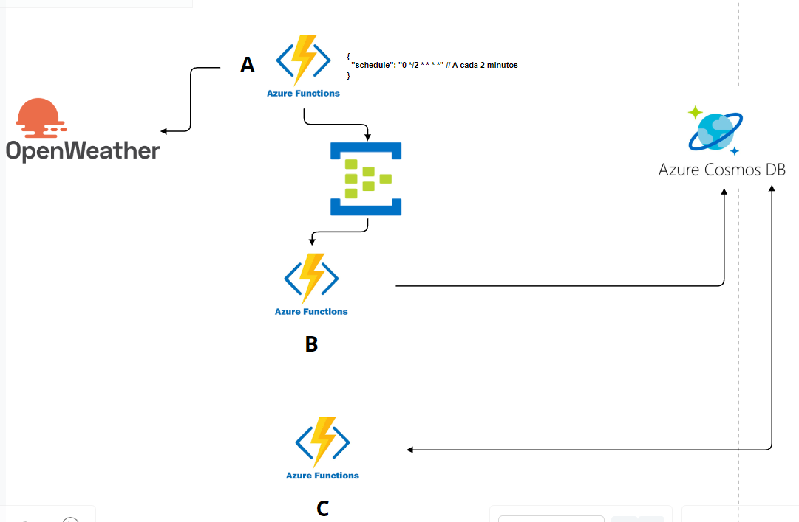

# Weathe




# Weather Data Processing with Azure Functions and Cosmos DB

Este projeto demonstra um sistema de coleta, processamento e apresentação de dados meteorológicos em tempo real usando Azure Functions e Cosmos DB.

## Visão Geral 

O sistema consiste em três Azure Functions:

1. **WeatherDataCollector**: Coleta dados meteorológicos periodicamente.
2. **WeatherDataProcessor**: Processa e armazena os dados coletados.
3. **WeatherDataApi**: Fornece uma API para acessar os dados armazenados.

## Componentes do Sistema

### 1. WeatherDataCollector (Function A)

- **Tipo**: Timer Trigger
- **Linguagem**: Java
- **Funcionalidade**:
    - Executa a cada 2 minutos
    - Coleta dados da API OpenWeatherMap
    - Envia os dados coletados para um Azure Event Hub

#### Código Principal:
```java
@FunctionName("WeatherDataCollector")
public void run(
    @TimerTrigger(name = "timerInfo", schedule = "0 */2 * * * *") String timerInfo,
    final ExecutionContext context
) {
    // ... (código de coleta e envio de dados)
}
```

### 2. WeatherDataProcessor (Function B)

- **Tipo**: Event Hub Trigger
- **Linguagem**: Java
- **Funcionalidade**:
    - Acionada quando novos dados chegam ao Event Hub
    - Processa os dados recebidos
    - Armazena os dados no Cosmos DB

#### Código Principal:
```java
@FunctionName("WeatherDataProcessor")
public void run(
    @EventHubTrigger(
        name = "message",
        eventHubName = "weather-data", 
        connection = "EventHubConnectionString") String message,
    final ExecutionContext context
) {
    // ... (código de processamento e armazenamento de dados)
}
```

### 3. WeatherDataApi (Function C)

- **Tipo**: HTTP Trigger
- **Linguagem**: Java
- **Funcionalidade**:
    - Fornece um endpoint HTTP
    - Recupera os dados mais recentes do Cosmos DB
    - Retorna os dados em formato JSON

#### Código Principal:
```java
@FunctionName("GetWeatherData")
public HttpResponseMessage run(
    @HttpTrigger(
        name = "req",
        methods = {HttpMethod.GET},
        authLevel = AuthorizationLevel.FUNCTION)
        HttpRequestMessage<Optional<String>> request,
    final ExecutionContext context
) {
    // ... (código de recuperação e retorno de dados)
}
```

## Configuração

### Pré-requisitos

- Java 8 ou superior
- Azure SDK para Java
- Uma conta Azure com acesso a Functions, Event Hubs e Cosmos DB

### Variáveis de Ambiente

Configure as seguintes variáveis de ambiente no seu aplicativo Azure Functions:

- `OpenWeatherMapApiKey`: Sua chave de API para OpenWeatherMap
- `EventHubConnectionString`: String de conexão para o seu Event Hub
- `EventHubName`: Nome do seu Event Hub
- `CosmosDBEndpoint`: Endpoint do seu Cosmos DB
- `CosmosDBKey`: Chave de acesso do seu Cosmos DB

### Dependências

Adicione as seguintes dependências ao seu `pom.xml`:

```xml
<dependencies>
    <dependency>
        <groupId>com.microsoft.azure.functions</groupId>
        <artifactId>azure-functions-java-library</artifactId>
        <version>1.4.2</version>
    </dependency>
    <dependency>
        <groupId>com.azure</groupId>
        <artifactId>azure-messaging-eventhubs</artifactId>
        <version>5.10.1</version>
    </dependency>
    <dependency>
        <groupId>com.azure</groupId>
        <artifactId>azure-cosmos</artifactId>
        <version>4.27.0</version>
    </dependency>
</dependencies>
```

## Implantação

1. Clone este repositório
2. Configure as variáveis de ambiente no portal Azure
3. Implante as funções usando o Azure Functions Core Tools ou diretamente do seu IDE

## Uso

Após a implantação, você pode:

1. Monitorar a Function A para ver a coleta periódica de dados
2. Verificar o Cosmos DB para confirmar o armazenamento dos dados
3. Chamar o endpoint HTTP da Function C para recuperar os dados mais recentes

## Considerações de Tempo Real

O uso do Cosmos DB neste projeto oferece várias vantagens para processamento em tempo real:

- **Baixa Latência**: Cosmos DB oferece tempos de resposta muito baixos, essenciais para aplicações em tempo real.
- **Escalabilidade**: Pode lidar com grandes volumes de dados e muitas solicitações simultâneas.
- **Consistência Flexível**: Permite ajustar o nível de consistência conforme necessário.
- **Indexação Automática**: Facilita consultas rápidas sem necessidade de gerenciamento manual de índices.

## Próximos Passos

- Implementar autenticação mais robusta para a API
- Adicionar mais endpoints para diferentes tipos de consultas
- Implementar um frontend para visualização dos dados
- Considerar o uso do Change Feed do Cosmos DB para processamento em tempo real ainda mais eficiente

## Contribuição

Contribuições são bem-vindas! Por favor, abra uma issue ou pull request para sugestões de melhorias.

## Licença

Este projeto está licenciado sob a [MIT License](LICENSE).# Weathe-Spring-Boot
